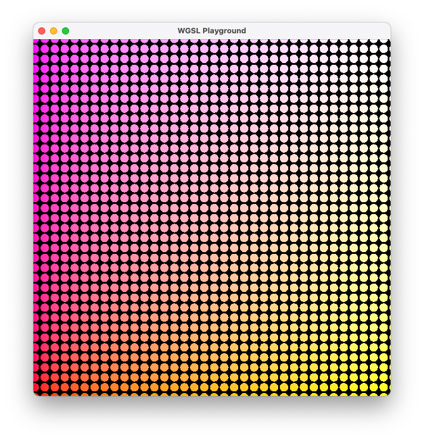

# wgsl-playground

This is a simple playground for playing with [WGSL](https://www.w3.org/TR/WGSL/) fragment shaders.
It is invoked by passing it a `wgsl` file. The program then looks for a framgent shader called
`fs_main` in the wgsl file provided and renders it across the window. This is similar to what
[shadertoy](https://www.shadertoy.com/) does, except using WGSL instead of GLSL and on the desktop
rather than in your browser.

`wgsl-playground` also watches the file for edits. Whenever you save the file, it rebuilds the pipeline
with the updated shader and swaps it into the redraw process.

Under the hood, it uses [wgsl](https://github.com/gfx-rs/wgpu) for rendering and
[naga](https://github.com/gfx-rs/naga) for validation.

**Note that WGSL is still an evolving spec.** This tool is for people who want to learn some WSGL
in its current form.

A number of examples shaders are in the `examples` directory. The screenshot above shows the `uniforms.wgsl` shader.

## Usage

Install with cargo:

    cargo install wgsl-playground

To run an existing `.wgsl` file, pass it on the command line:

    wgsl-playground myfragshader.wgsl

To create a new shader file, pass the `-c` flag and the file name to create. This is useful because
it provides the boilerplate to access uniforms and vertex data.

## Environment

The shader receives the following vertex input:
- The clip space (x, y) coordinate of this fragment as a `vec2<f32>` at `location=0`.
- The device coordinate window-relative coordinate of this fragment as a `vec4<f32>` at `builtin(position)` (i.e. equivalent to `gl_Position`)

 The following uniforms are also available:
- The clip space (x, y) coordinate of the location of the mouse cursor as a `vec2<f32>`. Only updates if the mouse cursor is within the bounds of the window. Starts at `(0.5, 0.5)`.
- The (fractional) number of seconds since the program started as a `f32`. It does *not* reset when the shader is reloaded.
